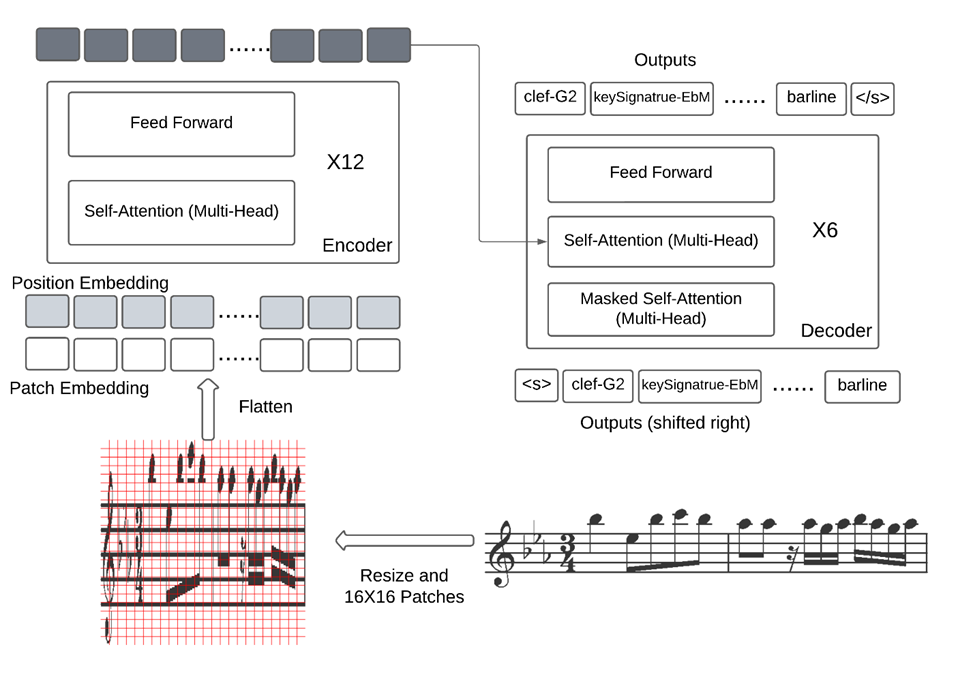

# Optical Music Recognition Using Vision Transformers

### General Architecture:

This model makes use of (by modifying and adapting) the encoder-decoder transformer architecture, proposed by Li et al. (2023), called TrOCR. TrOCR is a model trained for the purpose of OCR, primarily for the English language (alphabet). To be more specific, we will be using the TrOCR-SMALL variant, designed to be more data efficient (total parameters = 62 million). Instead of using this architecture and training from scratch, we utilize the pre-trained weights from TrOCR to see take advantage of transfer learning (even though this model is trained primarily for English based OCR and has no OMR related training). The model also uses a different tokenizer than what the model comes with.

Following is a diagram of the general architecture:

### Datasets:

Please download the datasets to use this model:
https://grfia.dlsi.ua.es/primus/

The (2018a) paper by Calvo-Zaragoza & Rizo, provides a new dataset called Printed Images of Music Staves (PrIMuS), containing over 87,678 real music incipits. This dataset has been designed for an end-to-end machine learning based systems. It features rendered images of monophonic sheet music (PNG) in randomized fonts (one of three) along with their ‘Music Encoding Initiative format’ (MEI) encodings that contain the symbolic (semantic) representation of the scores. The musical engraver software, Verovio (Pugin et al., 2014) is used for rendering these images along with their encodings. Using the MEI encodings, the simplified ‘semantic encodings’, and the ‘agnostic encodings’ (without musical meaning) are extracted. These two simplified encodings are the ones that the proposed model will be making use of. 

To extend the capabilities of this model to non-ideal situations as well as provide more data in the form of data-augmentation, Camera-PrIMuS (extension of PrIMuS) will also be used. (Calvo-Zaragoza & Rizo, 2018b) This dataset contains all the sheet music images from PrIMuS but with distortions applied to it in order to emulate imperfections that a camera would introduce in a real-world scenario. With the use of GraphicsMagick, an image processing tool, multiple filters are applied including implode, noise, rotation, and more, with random values within a specified range.

### Results:

Model is tested using SER (Symbol Error Rate):

Semantic Encoding-Printed -	1.8%

Agnostic Encoding- Printed - 1.1%

Semantic Encoding-Camera - 2.4%

Agnostic Encoding-Camera - 1.5%

----------------------

p.s. The code is easy to navigate, so there is not need for a detailed "how to use". There is a lot of commented code, which is only there to provide some ideas for future experiments. You can ignore the commented code.
Also, please only use the modified vocabulary.
Feel free to reach out to me at bsawhne3@uwo.ca if you need any assistance!
